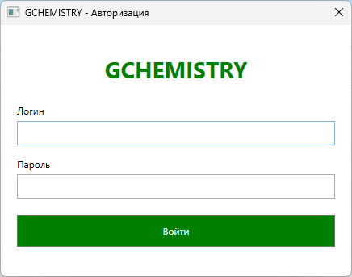
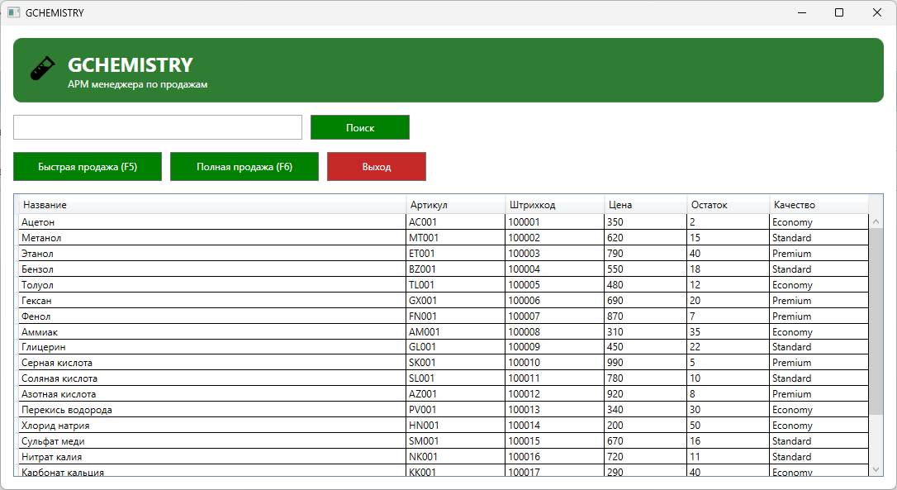
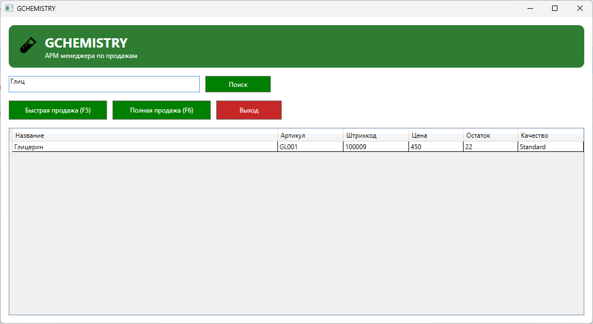
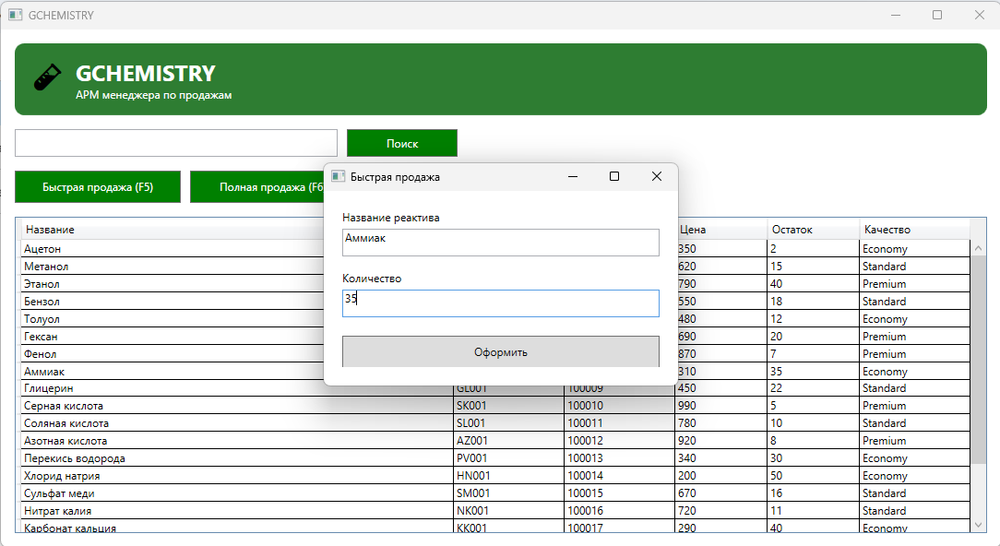
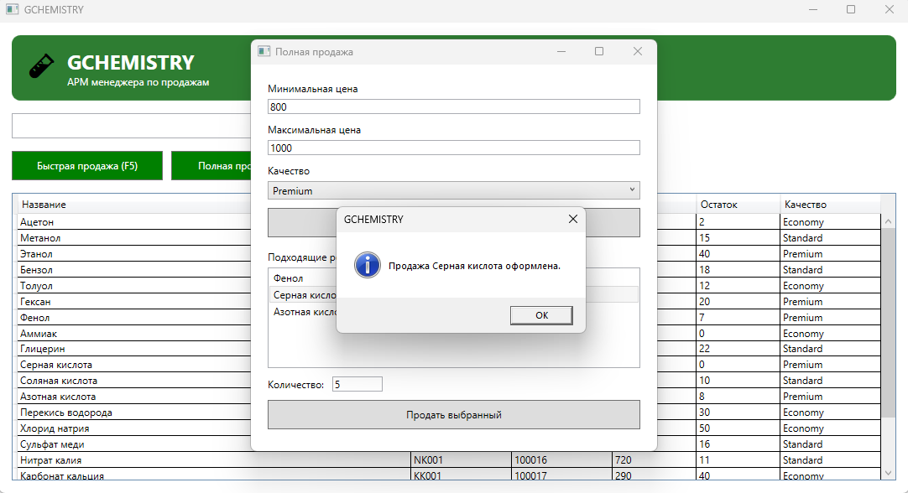

# GCHEMISTRY

GCHEMISTRY is a desktop WPF application for a sales manager who works with chemical reagents.

The project was made for a college course about Windows Forms and WPF development. It was built as a client-style project: my classmate acted as the client, gave the task, and checked the result during project testing.

## Purpose

The application is an automated workplace for a sales manager. It helps the user search products, check stock, and create sales faster than in an old and uncomfortable ERP interface.

The main goal was to create a simple, modern, and fast interface for everyday work.

## Features

- Login window with username and password
- Product search by name
- Product search by article number
- Product table with price, stock, barcode, and quality
- Quick sale window
- Full sale window with filters
- Stock quantity update after sale
- Input validation
- Keyboard shortcuts for faster work

## Keyboard Shortcuts

- `F1` - focus on search
- `F5` - open quick sale
- `F6` - open full sale

## Tech Stack

- C#
- WPF
- XAML
- .NET 6

## Data Storage

This project is a study prototype.

User accounts and product data are stored inside the application code or memory. Created sales are stored in memory while the program is running.

## Screenshots

### Login

### Main Window

### Product Search

### Quick Sale

### Full Sale

## My Role

I made this project by myself:

- analyzed the task
- designed the interface
- created the WPF windows
- worked with XAML and C#
- implemented search, sales, validation, and hotkeys
- wrote the project report
- prepared the presentation
- presented and defended the project

I used AI as a coding assistant to speed up development, especially because the project had to be finished quickly. I still read and understood the XAML and C# code, tested the application, wrote the documentation myself, and made the final decisions.

Roughly, I consider the work as 75% my own work and 25% AI assistance.

## Testing

The project was tested on June 29, 2026.

Tested scenarios:

- correct login
- incorrect login
- search by product name
- search by article number
- quick sale
- full sale
- stock update after sale
- incorrect input handling

No critical issues were found during the test.

## Documentation

The folder also contains a Russian project report written according to college/GOST-style requirements.

## Project Status

The application is finished as a college project prototype.

The repository will contain the executable file, report, screenshots, and README.
